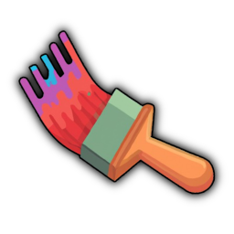

<p align="center">
  
</p>

<h1 align="center">OBSdraw</h1>

<p align="center">
  A secure, real-time collaborative drawing overlay for OBS Studio.
</p>

<p align="center">
  <a href="https://github.com/malithedeveloper/obsdraw/actions/workflows/ci.yml"></a>
  <a href="LICENSE"></a>
  
</p>

OBSdraw gives editors a shared whiteboard while OBS receives a transparent, read-only browser source. It supports pens, text, images, video, animated filters, live cursors, chat, layers, undo/redo, and persistent board history.

## Why OBSdraw

- A dedicated transparent viewer URL for OBS Browser Source
- Real-time collaboration over Socket.IO
- Separate editor and viewer credentials
- Local, Cloudflare R2, or WebDAV persistence
- Protected media with byte-range video streaming
- One-command setup, Docker support, and Heroku deployment metadata
- Strict media validation, SSRF protection, rate limiting, origin checks, and bounded messages

## Quick start

Requirements: [Node.js 22.19 or newer](https://nodejs.org/) and npm 10 or newer.

```bash
git clone https://github.com/malithedeveloper/obsdraw.git
cd obsdraw
npm run setup
npm run dev
```

`npm run setup` installs dependencies, creates `.env.local` with strong random secrets, creates the local data directory, and prints both URLs you need. It never replaces existing environment values.

Open `http://localhost:3000`, enter the generated access key, and choose a display name.

## Add OBSdraw to OBS Studio

1. Run OBSdraw and copy the viewer URL printed by `npm run setup`.
2. In OBS Studio, add a **Browser** source.
3. Paste the URL, for example `http://localhost:3000/view/<VIEW_KEY>`.
4. Set the width and height to match your canvas, usually `1920 × 1080`.
5. Leave custom CSS empty. OBSdraw already renders the viewer with a transparent background.
6. Enable **Refresh browser when scene becomes active** if you want a fresh connection on every scene activation.

The viewer key is read-only, but anyone who has it can see the board. Treat the complete viewer URL as a secret.

## Docker

Generate the environment file without installing local dependencies, then start the container:

```bash
npm run setup -- --skip-install
docker compose up --build -d
```

Board data is kept in the `obsdraw-data` Docker volume. Stop the service with `docker compose down`; add `--volumes` only when you intentionally want to delete persisted data.

## Heroku

[](https://heroku.com/deploy?template=https://github.com/malithedeveloper/obsdraw)

The deploy button generates all authentication secrets automatically. After deployment:

1. Open the app's **Settings → Config Vars** page.
2. Copy `ACCESS_KEY` for editors.
3. Build the OBS URL as `https://<your-app>.herokuapp.com/view/<VIEW_KEY>`.
4. Configure Cloudflare R2 or WebDAV before relying on the app for persistent data.

Heroku's filesystem is ephemeral. Without R2 or WebDAV, drawings and uploaded media can disappear after a restart or redeploy. See [Deployment](docs/DEPLOYMENT.md) for manual Heroku commands and storage configuration.

## Configuration

OBSdraw works with only four secrets:

| Variable | Purpose |
| --- | --- |
| `ACCESS_KEY` | Editor sign-in key |
| `VIEW_KEY` | Read-only OBS viewer key |
| `AUTH_SECRET` | Signs editor session cookies |
| `SOCKET_AUTH_SECRET` | Signs role-bound Socket.IO credentials |

Local disk storage is used by default. If all R2 variables are configured, R2 is used. Otherwise, if all WebDAV credentials are configured, WebDAV is used. Only one persistence backend is active at a time.

See [Configuration](docs/CONFIGURATION.md) for every supported variable, safe production defaults, key hashing, storage, media limits, and reverse-proxy settings.

## Useful commands

| Command | What it does |
| --- | --- |
| `npm run setup` | Generates local configuration and installs dependencies |
| `npm run dev` | Starts the Next.js and Socket.IO development server |
| `npm run build` | Creates a production build |
| `npm start` | Starts the production server after a build |
| `npm run check` | Runs lint, type-checks, tests, and a production build |
| `npm run audit` | Checks dependencies for high-severity vulnerabilities |

## Security

The editor session, viewer socket credential, media APIs, and websocket roles are independently validated. Remote-media requests block private, loopback, link-local, and metadata-service addresses during both DNS resolution and connection. Uploaded files are checked by signature, bounded by size and pixel count, and SVG is intentionally rejected.

For production, use HTTPS, keep all keys private, set `TRUST_PROXY=1` only behind a trusted proxy, and configure `ALLOWED_ORIGINS` when the public origin cannot be inferred reliably. Please report vulnerabilities privately as described in [SECURITY.md](SECURITY.md).

## Project structure

```text
src/app/                 Next.js pages and protected media routes
src/app/whiteboard/      Collaborative drawing client
src/lib/                 Authentication, storage, and media security
src/server/              Socket protocol validation and history logic
server.mjs               Shared Next.js and Socket.IO server
scripts/setup.mjs        Idempotent local setup
```

## Contributing

Contributions are welcome. Read [CONTRIBUTING.md](CONTRIBUTING.md), run `npm run check`, and include tests for protocol, authentication, storage, or security changes.

## License and Whitebophir attribution

OBSdraw is licensed under the [GNU Affero General Public License v3.0 only](LICENSE). If you run a modified version over a network, the AGPL requires you to offer the corresponding source code of that running version to its users.

This project is inspired by [Whitebophir](https://github.com/lovasoa/whitebophir) and is released under the same license to preserve its terms. See [NOTICE.md](NOTICE.md) for attribution. OBSdraw is an independent project and is not affiliated with the Whitebophir maintainers.
